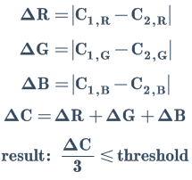
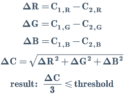
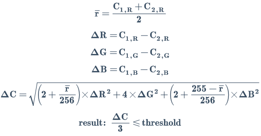
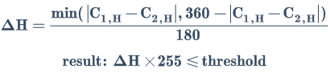
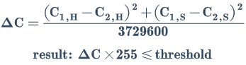

# 数据类型 (Data Types)

---

<p style="font: italic 1em sans-serif; color: #78909C">此章节待补充或完善...</p>
<p style="font: italic 1em sans-serif; color: #78909C">Marked by SuperMonster003 on Feb 22, 2023.</p>

---

数据类型是用来约束数据的解释.  
本章节的数据类型包括 [ number / void / any / object / 泛型 / 交叉类型 ] 等.

> 注: 此章节的类型概念 与 JavaScript 数据类型 (如 [基本类型](https://developer.mozilla.org/zh-CN/docs/Glossary/Primitive/)) 以及 TypeScript 数据类型 (如 [基础类型](https://www.typescriptlang.org/docs/handbook/2/everyday-types.html)) 在概念上可能存在出入, 因此仅适用于对文档内容的辅助理解, 不适用于严格的概念参考.

---

## Boolean

布尔类型.

**foo(bar)**

- **bar** { [boolean](#boolean) }

```js
foo(true); /* 符合预期. */
foo(false); /* 符合预期. */
foo(3); /* 不符合预期. */
```

需留意 JavaScript 的短路特性:

```js
/* 符合预期, 相当于 foo(false). */
foo(3 > 4);

/* 不符合预期, 相当于 foo("hello"). */
foo(3 > 4 || "hello");

/* 符合预期, 相当于 foo(false). */
foo(3 > 4 && "hello");

/* 不符合预期, 相当于 foo("hello"). */
foo(3 > 2 && "hello");
```

## Number

数字类型.

常用以下表示方法:

- `3` - 整数
- `+3` - 整数
    - 结果与 3 相同, 通常仅用于强调正负性
    - 这里的 "+" 并非符号, 而是一元运算符
- `-3` - 负数
- `3.1` - 小数
    - JS 使用 IEEE 754 双精度版本存储数字
    - 参阅: [0.1 + 0.2 !== 0.3](https://github.com/HXWfromDJTU/blog/issues/20)
- `3.0` - 整数
    - 结果与 3 相同, JS 没有 Double 等类型
- `.1` - 小数, 省略前导 0, 相当于 0.1
- `2e3` - 科学计数法, 相当于 2 × 10^3, 即 2000
    - 符号 e 表示 10 的幂, e 前后的数字分别称为有效数和幂次
    - 有效数可以为整数或小数字面量:
        - `1e2`, `3.1e2`, `-9e2`, `0e2`, `.1e2` 均合法
    - 幂次只能为整数字面量:
        - `1e2`, `1e-2` 均合法
    - e 的前后不能有变量或括号等符号:
        - `let num = 3;`
        - `nume2`, `(num)e2`, `(3)e(2)`, `3e(num)` 均不合法
- `0x23` - 十六进制
- `0b101` - 二进制
- `0o307` - 八进制
- `NaN` - 特殊数值
    - 参阅: [NaN](glossaries#nan)
- `Infinity` - 无穷大
- `-Infinity` - 负无穷大
- `Number.XXX` - Number 对象上的常量
    - 如 [Number\.EPSILON](https://developer.mozilla.org/zh-CN/docs/Web/JavaScript/Reference/Global_Objects/Number/EPSILON), [Number.MAX_VALUE](https://developer.mozilla.org/zh-CN/docs/Web/JavaScript/Reference/Global_Objects/Number/MAX_VALUE) 等
- `Math.XXX` - Math 对象上的常量
    - 如 [Math.PI](https://developer.mozilla.org/zh-CN/docs/Web/JavaScript/Reference/Global_Objects/Math/PI), [Math.SQRT2](https://developer.mozilla.org/zh-CN/docs/Web/JavaScript/Reference/Global_Objects/Math/SQRT2), [Math.LN2](https://developer.mozilla.org/zh-CN/docs/Web/JavaScript/Reference/Global_Objects/Math/LN2) 等

**foo(bar)**

- **bar** { [number](#number) }

```js
foo(3); /* 符合预期. */
foo(3.3); /* 符合预期. */
foo(3e3); /* 符合预期. */
foo(NaN); /* 符合预期. */
```

JavaScript 的所有数字都是浮点数, 因此 number 类型对 Double, Float, Long, Integer, Short 等均不作区分.

```js
3.0 === 3; // true
typeof new java.lang.Double(5.23).doubleValue(); // "number"
```

> 注: 如需表示一个很大的数 (超过 `2^53 - 1`), 需要用 [BigInt](glossaries#bigint) 表示.  
> 文档中通常不会出现 `bigint` 类型的数据, 包括 `number | bigint` 这样的 [联合类型](#联合类型) 数据.

## String

字符串类型.

常用以下表示方法:

- `"hello"` - 成对双引号 (`"`)
- `'hello'` - 成对单引号 (`'`)
- `&#96;hello&#96;` - 成对反引号 (`&#96;`)
    - 参阅: [模板字符串](https://developer.mozilla.org/zh-CN/docs/Web/JavaScript/Reference/Template_literals)
- `转义字符`
    - 如 `\n`, `\r`, `\uXXXX`, `\xXX` 等
    - 参阅: [转义字符](https://developer.mozilla.org/zh-CN/docs/Web/JavaScript/Reference/Global_Objects/String#%E8%BD%AC%E4%B9%89%E5%AD%97%E7%AC%A6)

**foo(bar)**

- **bar** { [string](#string) }

```js
foo("3"); /* 符合预期. */
foo('3.3'); /* 符合预期. */
foo(`3e3 equals to ${3000}`); /* 符合预期. */
foo(NaN.toString()); /* 符合预期. */
```

## Array

数组类型.

后缀 "[]" 代表数组类型.  
如 `number[]` 代表一个数组, 其中的元素全部为 [number](#number) 类型, 且元素数量不限 (包括 0, 即空数组).

> 注: `number[]` 与 `[number]` 不同, 后者表示 [元组类型](#tuple).

> 注: 使用 `Array<T>` 这样的 [泛型](#generic) 表示法也可代表数组类型, 但文档通常只采用后缀表示法.

**foo(bar)**

- **bar** { [string[]](#array) }

```js
foo([ "3" ]); /* 符合预期. */
foo([ 3 ]); /* 不符合预期. */
foo([ "3", 3 ]); /* 不符合预期. */
foo([]); /* 符合预期. */
```

## Tuple

元组类型.

元组类型严格限制数组的对应类型及元素数量.  
如 `[ number, number, string, number ]` 有如下限制:  
&#45; &#45; 数组有且必有 4 个元素;  
&#45; &#45; 元素类型依次为 number, number, string, number.

> 注: 需额外注意元组类型与 JSDoc 表示数组方法的异同.  
> 另外 JavaScript 中没有元组的概念.

**foo(bar)**

- **bar** { [&#91;](#tuple) [string](#string), [number](#number) [&#93;](#tuple) }

```js
foo([ "3" ]); /* 不符合预期. */
foo([ 3 ]); /* 不符合预期. */
foo([ "3", 3 ]); /* 符合预期. */
foo([]); /* 不符合预期. */
```

## Function

函数类型.

文档采用 [箭头函数](https://developer.mozilla.org/zh-CN/docs/Web/JavaScript/Reference/Functions/Arrow_functions) 表示一个函数参数.

**foo(bar)**

- **bar** { [() =>](#function) [number](#number) }

上述 [方法签名](documentation#方法签名) 中, bar 为函数参数, 该函数是一个无参函数且返回值为 number 类型.

```js
foo(Math.random()); /* 不符合预期. */

foo(function () {
    return Math.random();
}); /* 符合预期. */

foo(function () {
    return 'hello';
}); /* 不符合预期. */
```

**foo(bar)**

- **bar** { [(a: ](#function)[string](#string)[, b: ](#function)[any](#any)[) => ](#function)[string](#string) }

上述 [方法签名](documentation#方法签名) 中, bar 为函数参数, 该函数包含两个参函数且返回值为 string 类型.

```js
/* 参数 a 为 string 类型, b 为 any 类型. */
foo(function (a, b) {
    return a + String(b); /* 字符串拼接. */
}); /* 符合预期. */
```

## RegExp

正则表达式类型.

**foo(bar)**

- **bar** { [RegExp](#regexp) }

上述 [方法签名](documentation#方法签名) 中, bar 为正则表达式参数, 是 JavaScript 标准 RegExp 类型:

1. 字面量

   `foo(/hello.+world?/)`

2. RegExp 构造器

   `new RegExp('hello.+world?')`

> 参阅: [MDN](https://developer.mozilla.org/zh-CN/docs/Web/JavaScript/Reference/Global_Objects/RegExp)

## Any

任意类型.

类型 any 能够兼容所有类型.

**foo(bar)**

- **bar** { [any](#any) }

```js
foo(3); /* 符合预期. */
foo([]); /* 符合预期. */
foo({}); /* 符合预期. */
foo(null); /* 符合预期. */
```

尽管 any 可以兼容所有类型, 但仍需提供一个具体的类型, 不能省略:

```js
foo(); /* 不符合预期. */
foo(undefined); /* 符合预期. */
```

## Void

此类型用于表示一个函数没有返回值.

### 作为函数体返回值

**foo(bar)**

- **bar** { [any](#any) }
- <ins>**returns**</ins> { [void](#void) }

Void 作为 foo 函数体的返回值类型, 表示 foo 函数没有返回值:

```js
function foo() {
    console.log("hello");
} /* 符合预期. */

function foo() {
    return "hello";
} /* 不符合预期. */
```

### 作为参数返回值

**foo(bar)**

- **bar** { [() =>](#function) [void](#void) }

上述 [方法签名](documentation#方法签名) 中, bar 为函数参数,  
void 并非表示要求其返回值为 void,  
它表示 bar 返回的所有值均被忽略 (即不被关心).

```js
let arr = [];
foo(() => arr.push(Math.random())); /* 符合预期. */
console.log(arr);
```

### Void 与 Undefined

**foo(bar)**

- **bar** { [string](#string) }
- <ins>**returns**</ins> { [void](#void) }

在 JavaScript 中, 没有 return 语句的函数将默认返回 [undefined](#undefined).  
因此对于函数体, 返回值为 void 相当于 undefined:

```js
foo(() => {
    return;
}) /* 符合预期. */;

foo(() => {
    return undefined;
}) /* 符合预期. */;

foo(() => {
    // Empty body.
}) /* 符合预期. */;

foo(() => {
    return 3;
}) /* 不符合预期. */;
```

**foo(bar, baz)**

- **bar** { [() =>](#function) [void](#void) }
- **baz** { [() =>](#function) [undefined](#undefined) }

对于函数参数, 返回值 void 与 返回值 undefined 意义不同.  
void 表示返回的所有值均被忽略 (参阅 [作为参数返回值](#作为参数返回值)),  
而 undefined 表示返回值必须为 undefined 类型.

```js
foo(
    /* bar = */ () => {
        return;
    }, /* 符合预期. */
    /* baz = */ () => {
        return;
    }, /* 符合预期. */
);

foo(
    /* bar = */ () => {
        return undefined;
    }, /* 符合预期. */
    /* baz = */ () => {
        return undefined;
    }, /* 符合预期. */
);

foo(
    /* bar = */ () => {
        // Empty body.
    }, /* 符合预期. */
    /* baz = */ () => {
        // Empty body.
    }, /* 符合预期. */
);

foo(
    /* bar = */ () => {
        return 3;
    }, /* 符合预期. */
    /* baz = */ () => {
        return 3;
    }, /* 不符合预期. */
);
```

> 注: 上述方法签名如果将 void 替换为 any, 就 bar 参数是否符合预期方面而言, 效果是相同的.  
> 然而两者在语义上有明确不同, void 表示不关心 bar 的返回值, 而 any 表示任意返回值类型均可接受.  
> 在设计自定义 API 或设计 TS 声明文件时, 上述区分将显得尤为重要.

## Never

## Object

### 字面量对象类型

{{ a: number }}

## Generic

## Null

> 参阅: [MDN #术语](https://developer.mozilla.org/zh-CN/docs/Glossary/Null/) / [MDN #操作符](https://developer.mozilla.org/zh-CN/docs/Web/JavaScript/Reference/Operators/null/) / [MDN #Nullish](https://developer.mozilla.org/zh-CN/docs/Glossary/Nullish/)

## Undefined

```js
// device.vibrate(text: string, delay?: number): void
typeof device.vibrate("hello") === "undefined"; // true
```

> 参阅: [MDN #术语](https://developer.mozilla.org/zh-CN/docs/Glossary/undefined/) / [MDN #全局对象](https://developer.mozilla.org/zh-CN/docs/Web/JavaScript/Reference/Global_Objects/undefined/)

## RegExPattern

正则表达式模式类型.

通常只在 [操纵泛型](#pattern) 中使用.

**foo(bar)**

- **bar** { [Pattern](#pattern)[<](#generic)[/^\d+$/](#regexp)[>](#generic) }

```js
foo("1"); /* 符合预期. */
foo("123"); /* 符合预期. */
foo("hello"); /* 不符合预期. */
foo("1e3"); /* 不符合预期. */
foo("1.3"); /* 不符合预期. */
```

## 联合类型

# 操作符

## in

## keyof

## typeof

## extends

## index

## condition

## readonly

# 操纵泛型

例如 Array<T>.

## Uppercase

**Uppercase&lt;T>: string**

通常用于输出转换.  
接受 string 类型并生成所有字母大写的同类型数据.

## Lowercase

**Lowercase&lt;T>: string**

通常用于输出转换.  
接受 string 类型并生成所有字母小写的同类型数据.

## Capitalize

**Capitalize&lt;T>: string**

通常用于输出转换.  
接受 string 类型并生成首字母大写的同类型数据.

## IgnoreCase

**IgnoreCase&lt;T extends string>: T**

通常用于参数值的输入转换.  
接受 string 类型并生成忽略大小写的同类型数据.

例如, 对于 IgnoreCase<"webUrl">, 以下数据均符合预期:

```js
[ "webUrl", "WEBURL", "WebUrl", "WEBurl" ];
```

但不能在字符串前后或内部插入其他字符,  
如 [ "WEB_URL" / "web-url" / "#WebUrl" ] 等.

## Pattern

**Pattern&lt;[T](#generic) [extends](#extends) [RegExPattern](#regexpattern)>: [string](#string)**

通常用于输入检查.  
接受 [正则表达式字面量](glossaries#正则表达式) 并生成通过测试的 [string](#string) 类型数据.

Pattern 的泛型通配符 T 在文档中也称作 [字符串模式](glossaries#字符串模式).

**foo(bar)**

- **bar** { [Pattern](#pattern)[<](#generic)[/^https?:/](#regexpattern)[>](#generic) }

```js
foo("http is an abbreviation."); /* 不符合预期. */
foo("https://xxx"); /* 符合预期. */
foo("ftp://xxx"); /* 不符合预期. */
```

支持 [标记参数](https://developer.mozilla.org/zh-CN/docs/Web/JavaScript/Guide/Regular_Expressions#%E9%80%9A%E8%BF%87%E6%A0%87%E5%BF%97%E8%BF%9B%E8%A1%8C%E9%AB%98%E7%BA%A7%E6%90%9C%E7%B4%A2):

**foo(bar)**

- **bar** { [Pattern](#pattern)[<](#generic)[/^h...[oy]/i](#regexpattern)[>](#generic) }

```js
foo("Happy"); /* 符合预期. */
foo("hello"); /* 符合预期. */
foo("Halloween"); /* 符合预期. */
foo("history"); /* 符合预期. */
foo("heroes"); /* 不符合预期. */
```

为便于理解或重复引用, 有些 Pattern 类型会被重新定义为自定义类型, 如 [NumberString](dataTypes#numberstring).

> 注: 目前 (2022/08) 在 JSDoc 及 TypeScript 中,  
> 均不存在使用正则表达式字面量检查字符串的类型检查 (参阅 [StackOverflow](https://stackoverflow.com/questions/51445767/how-to-define-a-regex-matched-string-type-in-typescript)),  
> 上述 Pattern 类型仅适用于对文档内容的辅助理解.

## AnyBut

**AnyBut&lt;T>**

任意类型但排除 T.

**foo(bar)**

- **bar** { [AnyBut](#anybut)[<](#generic)[number](#number)[>](#generic) }

上述示例的 bar 参数接受除 [number](#number) 外的任意类型.

# 自定义类型

## JavaArray

Java Array (Java 数组).

```js
let javaArr = java.lang.reflect.Array
    .newInstance(java.lang.Float.TYPE, 3);

console.log(util.isJavaArray(javaArr)); // true
console.log(Array.isArray(javaArr)); // false
```

Java 数组可使用 JavaScript 数组的属性及方法:

```js
let javaArr = java.lang.reflect.Array
    .newInstance(java.lang.Float.TYPE, 3);

console.log(javaArr.length); // 3

console.log(javaArr.slice === Array.prototype.slice); // true
Array.isArray(javaArr.slice(0)); // true
```

Java 数组一旦被初始化, 长度将不可改变, [ 改变长度 / 越界赋值 ] 均会失败且抛出异常:

```js
let javaArr = java.lang.reflect.Array
    .newInstance(java.lang.Float.TYPE, 3);

/* 静默失败. */
javaArr.length = 20;
console.log(javaArr.length); // 3

/* push 或 unshift 导致越界抛出异常. */
javaArr.push(9); /* Error. */
javaArr.unshift(9); /* Error. */

/* pop 或 shift 不抛出异常但不改变数组长度. */
javaArr.pop();
console.log(javaArr.length); // 3
javaArr.shift();
console.log(javaArr.length); // 3

/* 越界访问不抛出异常, 会返回 undefined. */
console.log(javaArr[9]); // undefined

/* 越界赋值将抛出异常. */
javaArr[9] = 10; /* Error. */
```

Java 数组中的元素将隐式转换为指定的类型, 同时此类型也会被转换为 JavaScript 类型, 如 Java 的 Integer 等均转换为 Number:

```js
let javaArr = java.lang.reflect.Array
    .newInstance(java.lang.Integer.TYPE, 3);

console.log(javaArr.join()); // '0,0,0'

/* Number('1a') -> NaN */
javaArr[0] = '1a';
console.log(javaArr[0]); // NaN

/* Number('2.2') -> 2.2 $ JS */
/* java.lang.Integer(2.2 $ JS) -> 2 $ Java */
/* Number(2 $ Java) -> 2 $ JS */
javaArr[2] = '2.2';
console.log(javaArr[0]); // 2

/* 0xFF $ Hexadecimal == 255 $ Decimal / JS */
/* java.lang.Integer(255 $ JS) -> 255 $ Java */
/* Number(255 $ Java) -> 255 $ JS */
javaArr[0] = 0xFF;
console.log(javaArr[0]); // 255
```

> 参阅: [Oracle Docs](https://docs.oracle.com/javase/tutorial/java/nutsandbolts/arrays.html)

## JavaArrayList

Java ArrayList (Java 数组列表).

与 [Java Array](#javaarray) 不同的是, ArrayList 创建的数组可调整大小:

```js
let arrList = new java.util.ArrayList();

arrList.add(10);
arrList.add('20');
arrList.add([ '30' ]);
arrList.add(/40/g);

console.log(arrList.length); // 4

arrList.forEach((o) => {
    // 10 (Number)
    // 20 (String)
    // 30 (Array)
    // /40/g (RegExp)
    console.log(`${o} (${species(o)})`);
});

arrList.addAll(arrList);
console.log(arrList.length); // 8

arrList.clear();
console.log(arrList.length); // 0
```

> 参阅: [Oracle Docs](https://docs.oracle.com/javase/8/docs/api/java/util/ArrayList.html)

## NumberString

数字字符串.

[字符串模式](glossaries#字符串模式): `/[+-]?(\d+(\.\d+)?(e\d+)?)/`.

```js
"12";
"-5";
"1.5";
"1.5e3";
```

## ComparisonOperatorString

比较操作符字符串.

[字符串模式](glossaries#字符串模式): `/<=?|>=?|=/`.

```js
">";
">=";
"<";
"<=";
"="; /* 对应全等操作符 "===" . */
```

## ScreenMetricNumberX

屏幕横向度量值.

表示方式:

- 数字 { X >= 1 或 X < -1 } - 横向屏幕宽度值
- 数字 { X > -1 且 X < 1 } - 横向屏幕宽度值的百分比
- 数字 { X == -1 } - 横向屏幕宽度值本身 (代指值)

例如, 对于下面的参数:

**bottom** { [ScreenMetricNumberX](dataTypes#screenmetricnumberx) }

bottom 赋值为 50, 表示 X 坐标为 50.  
bottom 赋值为 -80, 表示 X 坐标为 -80.  
bottom 赋值为 0.5, 表示 X 坐标为 50% 横向屏幕宽度, 即 `0.5 * device.width`.  
bottom 赋值为 -0.1, 表示 X 坐标为 -10% 横向屏幕宽度, 即 `-0.1 * device.width`.  
bottom 赋值为 -1, 表示 X 坐标为横向屏幕宽度的代指值, 即 `device.width`.

## ScreenMetricNumberY

屏幕纵向度量值.

表示方式:

- 数字 { Y >= 1 或 Y < -1 } - 纵向屏幕高度值
- 数字 { Y > -1 且 Y < 1 } - 纵向屏幕高度值的百分比
- 数字 { Y == -1 } - 纵向屏幕高度值本身 (代指值)

例如, 对于下面的参数:

**top** { [ScreenMetricNumberY](dataTypes#screenmetricnumbery) }

top 赋值为 50, 表示 Y 坐标为 50.  
top 赋值为 -80, 表示 Y 坐标为 -80.  
top 赋值为 0.5, 表示 Y 坐标为 50% 纵向屏幕高度, 即 `0.5 * device.height`.  
top 赋值为 -0.1, 表示 Y 坐标为 -10% 纵向屏幕高度, 即 `-0.1 * device.height`.  
top 赋值为 -1, 表示 Y 坐标为纵向屏幕高度的代指值, 即 `device.height`.

## ScriptExecuteActivity

[android.app.Activity](https://developer.android.com/reference/android/app/Activity) 的子类.

ScriptExecuteActivity 是 UI 模式下, 全局对象 activity 的类型:

```js
'ui';
activity instanceof org.autojs.autojs.execution.ScriptExecuteActivity; // true
```

一些 activity 相关的示例:

```js
/* 结束当前 activity. */
activity.finish();
/* 设置状态栏颜色为深红色. */
activity.getWindow().setStatusBarColor(colors.toInt('dark-red'));
/* 将视图对象作为内容加载. */
activity.setContentView(web.newInjectableWebView('www.github.com'));
/* 获取顶层窗口的高度. */
activity.getWindow().getDecorView().getRootView().getHeight();
```

因 ScriptExecuteActivity 继承了 android.app.Activity 等非常多的 Java 类, 因此 activity 获得了非常丰富的属性和方法, 详情参阅 [Android Docs](https://developer.android.com/reference/android/app/Activity) 及 [AutoJs6 源码](http://project.autojs6.com/blob/10960ddbee71f75ef80907ad5b6ab42f3e1bf31e/app/src/main/java/org/autojs/autojs/execution/ScriptExecuteActivity.java#L30).

## DetectCompass

用于传递给 [控件罗盘](uiObjectType#m-compass) 的参数类型, 又称 `罗盘参数`.

罗盘参数是 [字符串](dataTypes#string) 类型, 支持单独或组合使用.

下面列举了部分罗盘参数示例:

- `p` - 父控件
- `p2` - 二级父控件
- `c0` - 索引 0 (首个) 子控件
- `c2` - 索引 2 子控件
- `c-1` - 末尾子控件
- `s5` - 索引 5 兄弟控件
- `s-2` - 倒数第 2 兄弟控件
- `s<1` - 相邻左侧兄弟节点
- `s>1` - 相邻右侧兄弟节点
- `k2` - 向上寻找可点击控件 (最多 2 级)
- `p4c0>1>1>0s0` - 组合使用

[控件罗盘 (UiObject.compass)](uiObjectType#m-compass) 是 [控件探测 (UiObject.detect)](uiObjectType#m-detect) 的衍生方法, 因此类型命名采用了 `DetectCompass`.

## DetectResult

[控件探测 (UiObject.detect)](uiObjectType#m-detect) 的结果参数类型, 又称 `探测结果`, 此过程也称为 `结果筛选`.

- `# / w / widget` - [控件](uiObjectType)
- `$ / txt / content` - [文本内容](uiObjectType#m-content)
- `. / pt / point` - [点](uiObjectType#m-point)
- `UiObjectInvokable` - [控件可调用类型](#uiobjectinvokable)

```js
/* 控件. */
detect(w, '#');
detect(w, 'w'); /* 同上. */
detect(w, 'widget'); /* 同上. */

/* 文本内容. */
detect(w, '$');
detect(w, 'txt'); /* 同上. */
detect(w, 'content'); /* 同上. */

/* 点. */
detect(w, '.');
detect(w, 'pt'); /* 同上. */
detect(w, 'point'); /* 同上. */

/* UiObjectInvokable (控件可调用类型). */
detect(w, 'click'); /* i.e. w.click() */
detect(w, [ 'setText', 'hello' ]); /* i.e. w.setText('hello') */
```

不同于 [PickupResult (拾取结果)](#pickupresult), `探测结果` 的种类相对较少.

## DetectCallback

探测回调.

探测回调用于处理 [控件探测 (UiObject.detect)](uiObjectType#m-detect) 的结果.

`回调结果` 将影响 `探测结果`, 当 `回调结果` 返回 `undefined` 时, 将直接返回 `探测结果`, 否则返回 `回调结果`:

```ts
function detect<T extends UiObject, R>(w: T, callback: (w: T) => R): T | R {
    let callbackResult: R = callback(w);
    return callbackResult == undefined ? w : callbackResult;
}
```

示例:

```js
let w = pickup(/.+/);

/* 返回 w.content() 的结果. */
detect(w, (w) => w.content());

/* 返回 w 的结果. */
detect(w, (w) => {
    console.log(w.content());
});
```

## PickupSelector

[拾取选择器](uiSelectorType#m-pickup) 的 `选择器参数`.

`选择器参数` 的类型分为 [单一型选择器](#单一型选择器) 和 [混合型选择器](#混合型选择器).

### 单一型选择器

单一型选择器包含 [ [经典选择器](#经典选择器) / [内容选择器](#内容选择器) / [对象选择器](#对象选择器) ].

#### 经典选择器

`text('abc')` 或串联形式 `text('abc').clickable().centerX(0.5)`.

#### 内容选择器

字符串 `'abc'` 或正则表达式 `/abc/`.  
相当于 `content('abc')` 及 `contentMatch(/abc/)`.

#### 对象选择器

将选择器名称作为 `键 (key)`, 选择器参数作为 `值 (value)`.  
若参数多于 1 个, 使用数组包含所有参数; 若无参数, 使用 `[]` (空数组) 或 `null`, 或默认值 (如 `true`).  
虽然一个参数也可使用数组, 但通常无必要.

```js
/* 经典选择器. */
let selClassic = text('abc').clickable().centerX(0.5).boundsInside(0.2, 0.05, -1, -1).action('CLICK', 'SET_TEXT', 'LONG_CLICK');

/* 对象选择器. */
let selObject = {
    text: 'abc',
    clickable: [], /* 或 clickable: true . */
    centerX: 0.5,
    boundsInside: [ 0.2, 0.05, -1, -1 ],
    action: [ 'CLICK', 'SET_TEXT', 'LONG_CLICK' ],
};
```

### 混合型选择器

混合型选择器由多个单一型选择器组成.

用数组表示一个混合型选择器, 其中的元素为单一型选择器:

```js
pickup([ /he.+/, clickable(true).boundsInside(0.2, 0.05, -1, -1) ]);
```

上述示例的选择器参数使用了混合型选择器, 它包含两个单一型选择器, 分别为 [内容选择器](#内容选择器) 和 [经典选择器](#经典选择器).

上述示例可以转换为单一型选择器:

```js
/* 对象选择器. */
pickup({
    contentMatch: /he.+/,
    clickable: true,
    boundsInside: [ 0.2, 0.05, -1, -1 ],
});

/* 经典选择器. */
pickup(contentMatch(/he.+/).clickable(true).boundsInside(0.2, 0.05, -1, -1));
```

## PickupResult

[拾取选择器 (UiSelector#pickup)](uiSelectorType#m-pickup) 的结果参数类型, 又称 `拾取结果`, 此过程也称为 `结果筛选`.

- `# / w / widget` - [控件 (UiObject)](uiObjectType)
- `{} / #{} / {#} / w{} / {w} / wc / collection / list` -> [控件集合 (UiObjectCollection)](uiObjectCollectionType)
- `[] / #[] / [#] / w[] / [w] / ws / widgets` -> [控件 (UiObject)](uiObjectType) 数组
- `$ / txt / content` - [文本内容 (UiObject#content)](uiObjectType#m-content)
- `$[] / [$] / txt[] / [txt] / content[] / [content] / contents` -> [文本内容 (UiObject#content)](uiObjectType#m-content) 数组
- `. / pt / point` - [点 (UiObject#point)](uiObjectType#m-point)
- `.[] / [.] / point[] / [point] / pt[] / [pt] / points / pts` -> [点 (UiObject#point)](uiObjectType#m-point) 数组
- `@ / selector / sel` -> [选择器 (UiSelector)](uiSelectorType)
- `? / exists` -> [存在判断 (UiSelector#exists)](uiSelectorType#m-exists)
- `UiObjectInvokable` - [控件可调用类型](#uiobjectinvokable)

```js
/* 控件. */
pickup(sel, '#');
pickup(sel, 'w'); /* 同上. */
pickup(sel, 'widget'); /* 同上. */

/* 文本内容. */
pickup(sel, '$');
pickup(sel, 'txt'); /* 同上. */
pickup(sel, 'content'); /* 同上. */

/* 文本内容数组. */
pickup(sel, '$[]');
pickup(sel, 'txt[]'); /* 同上. */
pickup(sel, '[content]'); /* 同上. */
pickup(sel, 'contents'); /* 同上. */

/* 点. */
pickup(sel, '.');
pickup(sel, 'pt'); /* 同上. */
pickup(sel, 'point'); /* 同上. */

/* 点数组. */
pickup(sel, '.[]');
pickup(sel, '[.]'); /* 同上. */
pickup(sel, '[point]'); /* 同上. */
pickup(sel, 'points'); /* 同上. */

/* UiObjectInvokable (控件可调用类型). */
pickup(sel, 'click'); /* i.e. sel.findOnce().click() */
pickup(sel, [ 'setText', 'hello' ]); /* i.e. sel.findOnce().setText('hello') */
```

与 [DetectResult (探测结果)](#detectresult) 相比, `拾取结果` 的种类更加丰富.

## UiObjectInvokable

控件可调用类型, 用于使用参数形式实现方法调用, 又称 `参化调用`.

支持所有 [UiObject](uiObjectType) 的实例方法, 如果方法需要传递参数, 需要将参数连同方法名称放入数组后再传递.

```js
/* 无参方法. */
detect(w, 'click'); /* i.e. w.click() */
detect(w, 'imeEnter'); /* i.e. w.imeEnter() */

/* 含参方法. */
detect(w, [ 'child', 0 ]); /* i.e. w.child(0) */
detect(w, [ 'setText', 'hello' ]); /* i.e. w.setText('hello') */
detect(w, [ 'setSelection', 2, 3 ]); /* i.e. w.setSelection(2, 3) */
```

## RootMode

Root 模式, 枚举类型, 已全局化.

| 枚举实例名          | 描述                                                   | <span style="white-space:nowrap">JavaScript 代表参数</span>        |
|----------------|------------------------------------------------------|----------------------------------------------------------------|
| AUTO_DETECT    | <span style="white-space:nowrap">自动检测 Root 权限</span> | '<span style="white-space:nowrap">auto' / -1</span>            |
| FORCE_ROOT     | <span style="white-space:nowrap">强制 Root 模式</span>   | <span style="white-space:nowrap"> 'root' / 1 / true</span>     |
| FORCE_NON_ROOT | <span style="white-space:nowrap">强制非 Root 模式</span>  | <span style="white-space:nowrap">'non-root' / 0 / false</span> |

检测 Root 模式:

```js
console.log(autojs.getRootMode() === RootMode.AUTO_DETECT);
console.log(autojs.getRootMode() === RootMode.FORCE_ROOT);
console.log(autojs.getRootMode() === RootMode.FORCE_NON_ROOT);
```

设置 Root 模式, 以设置 '强制 Root 模式' 为例:

```js
autojs.setRootMode(RootMode.FORCE_ROOT);
autojs.setRootMode('root'); /* 同上. */
autojs.setRootMode(1); /* 同上. */
autojs.setRootMode(true); /* 同上. */
```

## ColorHex

颜色代码 (Color Hex Code).

在网页中经常使用的形如 `#FF4500` 的字符串表示一个颜色.

在 AutoJs6 中, 有三种表示方式, 均使用十六进制代码表示:

### #AARRGGBB

使用四个分量表示颜色, 分量顺序固定为 `A (alpha)`, `R (red)`, `G (green)`, `B (blue)`. 每个分量使用 `[0..255]` 对应的十六进制数表示, 不足两位时需补零.

例如一个颜色使用 `rgba(120, 14, 224, 255)` 表示, 将其转换为 `#AARRGGBB` 格式:

```text
R: 120 -> 0x78
G: 14 -> 0xE
B: 224 -> 0xE0
A: 255 -> 0xFF
#AARRGGBB -> #FF780EE0
```

注意上述示例的 `G` 分量需补零.

> 扩展阅读:
>
> 反向转换, 即 '#FF780EE0' 转换为 RGBA 分量:  
> colors.toRgba('#FF780EE0'); // [ 120, 14, 224, 255 ]
>
> 获取单独的分量:  
> let [r, g, b, a] = colors.toRgba('#FF780EE0');  
> console.log(r); // 120

### #RRGGBB

当 `A (alpha)` 分量为 `255 (0xFF)` 时, 可省略 `A` 分量:

```js
colors.toInt('#CD853F') === colors.toInt('#FFCD853F'); // true
```

获取 `#RRGGBB` 的 `A (alpha)` 分量, 将得到 `255`:

```js
colors.alpha('#CD853F'); // 255
```

需额外留意, 当使用十六进制数字表示颜色时, `FF` 不可省略:

```js
colors.toHex('#CD853F', 8); // #FFCD853F
colors.toHex('#FFCD853F', 8); // #FFCD853F
colors.toHex(0xCD853F); // #00CD853F
colors.toHex(0xFFCD853F); // #FFCD853F
```

### #RGB

`#RRGGBB` 十六进制代码的三位数简写形式, 如 `#BBFF33` 可简写为 `#BF3`, `#FFFFFF` 可简写为 `#FFF`.

与 `#RRGGBB` 相同, `#RGB` 的 `A (alpha)` 分量也恒为 `255 (0xFF)`.

```js
colors.toInt('#BBFF33') === colors.toInt('#BF3'); // true
colors.alpha('#BF3') === 255; // true
```

## ColorInt

颜色整数 (Color Integer).

多数情况下, 使用颜色整数代表一个颜色.  
在安卓源码中, 颜色整数用 `ColorInt` 表示, 其值的范围由 `Java` 的 `Integer` 类型决定, 即 `[-2^31..2^31-1]`.  
例如数字 `0xBF110523` 对应十进制的 `3205563683`, 超出了上述 `ColorInt` 的范围, 因此相关方法 (如 [colors.toInt](color#m-toint)) 会将此数值通过 `2^32` 偏移量移动至合适的范围内, 最终得到结果 `-1089403613`.

```js
colors.toInt(0xBF110523); // -1089403613
colors.toInt('#BF110523'); /* 结果同上. */

console.log(0xBF110523); // 3205563683
console.log(0xBF110523 - 2 ** 32); // -1089403613
```

由此可知, 当 `ColorInt` 作为参数类型传入时, 没有范围限制, 因为参数会通过 `2^32` 偏移量移动至上述合法范围内. 如 `colors.toHex(0xFFFF3300)` 将正确返回 `"#FF3300"`, 虽然参数 `0xFFFF3300` 并不在 `[-2^31..2^31-1]` 范围内.

当 `ColorInt` 作为返回值类型时, 其返回值一定位于 `[-2^31..2^31-1]` 范围内. 如 `colors.toInt(0xFFFF3300)` 返回 `-52480`, 此返回值缺乏可读性, 通常只用于作为新的参数传入其他方法.

> 注:  
> 事实上, `-52480` 是 `0xFFFF3300 - 2 ** 32` 的结果.  
> 如需将 `-52480` 这样的值还原为具有可读性的颜色代码, 可使用 [colors.toHex](color#m-tohex) 等方法.

## ColorName

颜色名称.

[颜色列表 (Color Table)](colorTable) 章节中, 各个颜色列表中 "变量名" 的字符串形式可直接作为颜色名称使用:

```js
/* CSS 颜色列表中的 ORANGE_RED. */

/* 作为 ColorInt 使用. */
colors.toHex(colors.css.ORANGE_RED);
/* 作为 ColorName 使用. */
colors.toHex('ORANGE_RED');

/* WEB 颜色列表中的 CREAM. */

/* 作为 ColorInt 使用. */
colors.toHex(colors.web.CREAM);
/* 作为 ColorName 使用. */
colors.toHex('CREAM');
```

### 名称冲突

当使用 `颜色名称 (ColorName)` 作为参数时, 同一个名称可能同时出现在不同的 [颜色列表](colorTable) 中, 如 `CYAN` 在所有列表中均有出现, 且 [Material 颜色列表](colorTable#material-颜色列表) 中的 `CYAN` 与其它列表中的 `CYAN` 颜色不同.

为避免上述冲突, 按如下命名空间优先级查找并使用颜色名称对应的颜色:

```text
android > css > web > material
```

详情参阅 [颜色列表 (Color Table)](colorTable) 章节的 [颜色名称冲突](colorTable#颜色名称冲突) 小节.

### 参数格式

ColorName 除了大写形式 (如 `BLACK` 或 `DARK_RED`) 外, 还支持以下几种格式 (以 `LIGHT_GREY` 为例):

- `LIGHT_GREY` -- 大写 + 下划线
- `LIGHTGREY` -- 大写合并
- `light_grey` -- 小写 + 下划线
- `lightgrey` -- 小写合并
- `light-grey` -- 小写 + 连字符

因此下面示例代码的结果是相同的:

```js
colors.toInt(colors.LIGHT_GREY);
colors.toInt('LIGHT_GREY');
colors.toInt('LIGHTGREY');
colors.toInt('light_grey');
colors.toInt('lightgrey');
colors.toInt('light-grey');
```

## ColorComponent

颜色分量类型.

例如表示一个值为 `128` 的 `R (red)` 分量, 可使用 `128`, `0.5` 及 `50%` 等表示法.

### 分量表示法

通常使用整数表示一个颜色分量, 如 `colors.rgb(10, 20, 30)`.  
RGB 系列色彩模式范围为 `[0..255]`, HSX 系列色彩模式范围为 `[0..100]`.

除上述整数分量表示法, AutoJs6 还支持百分数等方式表示一个颜色分量 (如 `0.2`, `"20%"` 等).

下表列举了 AutoJs6 支持的分量表示法:

**1. 整数**

| 样例                            | 等效语句                           | 备注                                        |
|-------------------------------|--------------------------------|-------------------------------------------|
| colors.rgb(64, 32, 224)       | -                              | -                                         |
| colors.rgba(64, 32, 224, 255) | -                              | -                                         |
| colors.hsv(30, 20, 60)        | colors.hsv(30, 0.2, 0.6)       | S (saturation) 和 V (value) 分量范围为 [0..100] |
| colors.hsva(30, 20, 60, 255)  | colors.hsva(30, 0.2, 0.6, 255) | A (alpha) 分量范围为 [0..255]                  |

**2. 浮点数**

| 样例                               | 等效语句                         | 备注        |
|----------------------------------|------------------------------|-----------|
| colors.rgb(0.5, 0.25, 0.125)     | colors.rgb(128, 64, 32)      | -         |
| colors.rgba(0.5, 0.25, 0.1, 0.2) | colors.rgba(128, 64, 26, 51) | -         |
| colors.hsv(10, 0.3, 0.2)         | colors.hsv(10, 30, 20)       | -         |
| colors.hsva(10, 0.3, 0.2, 0.5)   | colors.hsva(10, 30, 20, 128) | 不同分量的范围不同 |

**3. 百分数**

| 样例                                      | 等效语句                         | 备注        |
|-----------------------------------------|------------------------------|-----------|
| colors.rgb('50%', '25%', '12.5%')       | colors.rgb(128, 64, 32)      | -         |
| colors.rgba('50%', '25%', '10%', '20%') | colors.rgba(128, 64, 26, 51) | -         |
| colors.hsv(10, '30%', '20%')            | colors.hsv(10, 30, 20)       | -         |
| colors.hsva(10, '30%', '20%', '50%')    | colors.hsva(10, 30, 20, 128) | 不同分量的范围不同 |

### 表示范围

不同分量的范围不同, 当使用浮点数或百分数等表示法时, 需留意其表示范围:

| 分量             | 范围       |
|----------------|----------|
| R (red)        | [0..255] |
| G (green)      | [0..255] |
| B (blue)       | [0..255] |
| A (alpha)      | [0..255] |
| H (hue)        | [0..360] |
| S (saturation) | [0..100] |
| V (value)      | [0..100] |
| L (lightness)  | [0..100] |

```js
colors.hsva(0.5, 0.5, 0.5, 0.5);
colors.hsva(180, 50, 50, 128); /* 同上. */
```

### 表示法组合

分量表示法支持组合使用:

```js
colors.rgb(0.5, '25%', 32); /* 相当于 colors.rgb(128, 64, 32) . */
colors.rgba(0.5, '25%', 32, '50%'); /* 相当于 colors.rgba(128, 64, 32, 128) . */
```

### 灵活的 1

在组合使用分量表示法时, `1` 既可作为整数分量也可作为百分数分量, 原则如下:

对于非 `RGB` 分量, 如 `A (alpha)`, `S (saturation)`, `V (value)`, `L (lightness)` 等, `1` 一律解释为 `100%`.

```js
colors.argb(1, 255, 255, 255); /* 相当于 argb(255, 255, 255, 255), 1 解释为 100% . */
colors.hsv(60, 1, 0.5); /* S 分量相当于 100, 1 解释为 100% . */
colors.hsla(0, 1, 1, 1); /* 相当于 hsla(0, 100, 100, 255) . */
```

而对于 `RGB` 分量, 只有当 `R` / `G` / `B` 三个分量全部满足 `c <= 1` 且不全为 `1` 时, 解释为百分数 `1` (即 `100%`), 其他情况, 解释为整数 `1`.

```js
colors.rgb(1, 0.2, 0.5); /* 相当于 rgb(255, 51, 128), 1 解释为 100%, 得到 255 . */
colors.rgb(1, 0.2, 224); /* 相当于 rgb(1, 51, 224), 1 解释为 1 . */
colors.rgb(1, 160, 224); /* 无特殊转换, 1 解释为 1 . */
colors.rgb(1, 1, 1); /* 相当于 rgb(1, 1, 1), 颜色代码为 #010101, 1 全部解释为 1 . */
colors.rgb(1, 1, 0.5); /* 相当于 rgb(255, 255, 128), 1 全部解释为 100% . */
```

由此可见, 对于 `RGB` 分量, 只要有一个分量使用了 `0.x` 的百分数表示法, `1` 将全部解释为 `255 (100%)`.

### 1 与 1.0

`JavaScript` 只有数字类型, `1` 与 `1.0` 没有区别, 以下两个语句完全等价:

```js
colors.rgb(1, 1, 0.5);
colors.rgb(1.0, 1.0, 0.5); /* 同上. */
```

因此当使用 `1` 表示 `100%` 传入一个颜色分量参数时, 建议使用 `1.0` 以增加可读性:

```js
colors.hsla(120, 0.32, 1.0, 0.5); /* 使用 1.0 代表 100% . */
```

## ColorComponents

[颜色分量](#colorcomponent) 数组.

同一种颜色可用不同的色彩模式表示, 如 RGB 色彩模式或 HSV 色彩模式等.

每个色彩模式的 `分量 (Component)` 组成的数组称为颜色分量数组, 如 RGB 色彩模式的分量数组 `[100, 240, 72]` 表示 `R (red)` 分量为 `100`, `G (green)` 分量为 `240`, `B (blue)` 分量为 `72`, 访问时可使用数组下标方式或解构赋值方式:

```js
let components = colors.toRgb(colors.rgb(100, 240, 72)); // [ 100, 240, 72 ]

/* 数组下标方式. */
console.log(`R: ${components[0]}, G: ${components[1]}, B: ${components[2]}`);

/* 结构赋值方式. */
let [ r, g, b ] = components;
console.log(`R: ${r}, G: ${g}, B: ${b}`);
```

colors 全局对象的很多 "to" 开头的方法都可返回颜色分量数组, 如 [toRgb](color#m-torgb), [toHsv](color#m-tohsv), [toHsl](color#m-tohsl), [toRgba](color#m-torgba), [toArgb](color#m-toargb) 等.

需额外注意 [toRgba](color#m-torgba) 和 [toArgb](color#m-toargb) 结果中的 `A (alpha)` 分量, 默认范围为 `[0..255]`, 而其他方法则恒为 `[0..1]`:

```js
colors.toRgba('blue-grey')[3]; /* A 分量为 255. */
colors.toArgb('blue-grey')[0]; /* A 分量为 255. */
colors.toHsva('blue-grey')[3]; /* A 分量为 1. */
colors.toHsla('blue-grey')[3]; /* A 分量为 1. */
```

如需使 `toRgba` 和 `toArgb` 结果中 `A (alpha)` 分量范围也为 `[0..1]`, 可使用 `maxAlpha` 参数:

```js
colors.toRgba('blue-grey', { maxAlpha: 1 })[3]; /* A 分量为 1. */
```

## ColorDetectionAlgorithm

颜色检测算法, 用于检测两个颜色之间的差异程度, 即颜色差异.

[颜色差异](https://zh.wikipedia.org/wiki/%E9%A2%9C%E8%89%B2%E5%B7%AE%E5%BC%82) ([Color Difference](https://en.wikipedia.org/wiki/Color_difference)), 也称为颜色距离, 是色彩学领域的一个参量.  
颜色差异将一个抽象概念进行了量化, 例如可以通过色彩空间内的 [欧氏距离](https://zh.wikipedia.org/wiki/%E6%AC%A7%E6%B0%8F%E8%B7%9D%E7%A6%BB) ([Euclidean Distance](https://en.wikipedia.org/wiki/Euclidean_distance)) 计算出一个具体的差异量.

量化颜色差异时, 存在多种不同的量化方法, 通常使用颜色检测算法计算欧式距离, 由此距离进行颜色差异的量化.

AutoJs6 内置了几种不同的颜色检测算法, 这些算法通常作为参数传入到某个函数中.

### RGB 差值检测

参数名称: `diff`

计算两个 RGB 颜色各分量的差值:

<picture>
  <source srcset="images/rgb-difference-color-detection-dark.png" media="(prefers-color-scheme: dark) and (max-width: 1024px)" width="430px">
    <source srcset="images/rgb-difference-color-detection-dark.png" media="(prefers-color-scheme: dark) and (min-width: 1024px)" width="215px">
    <source srcset="images/rgb-difference-color-detection.png" media="(min-width: 1024px)" width="215px">
    
</picture>

### RGB 距离检测

参数名称: `rgb`

计算 RGB 色彩空间中两点间距离:

<picture>
  <source srcset="images/rgb-distance-color-detection-dark.png" media="(prefers-color-scheme: dark) and (max-width: 1024px)" width="508px">
    <source srcset="images/rgb-distance-color-detection-dark.png" media="(prefers-color-scheme: dark) and (min-width: 1024px)" width="254px">
    <source srcset="images/rgb-distance-color-detection.png" media="(min-width: 1024px)" width="254px">
    
</picture>

### 加权 RGB 距离检测

参数名称: `rgb+`

带有权重的 RGB 距离检测 (Delta E):

<picture>
  <source srcset="images/weighted-rgb-distance-color-detection-dark.png" media="(prefers-color-scheme: dark) and (max-width: 1024px)" width="1070px">
    <source srcset="images/weighted-rgb-distance-color-detection-dark.png" media="(prefers-color-scheme: dark) and (min-width: 1024px)" width="535px">
    <source srcset="images/weighted-rgb-distance-color-detection.png" media="(min-width: 1024px)" width="535px">
    
</picture>

> 参阅:   
> [Colour metric (from compuphase.com)](https://www.compuphase.com/cmetric.htm)  
> [CIELAB Delta E* (from Wikipedia)](https://en.wikipedia.org/wiki/Color_difference#CIELAB_%CE%94E*)

### H 距离检测

参数名称: `h`

HSV 色彩空间中 `H (hue)` 分量的距离检测:

<picture>
  <source srcset="images/h-distance-color-detection-dark.png" media="(prefers-color-scheme: dark) and (max-width: 1024px)" width="821px">
    <source srcset="images/h-distance-color-detection-dark.png" media="(prefers-color-scheme: dark) and (min-width: 1024px)" width="411px">
    <source srcset="images/h-distance-color-detection.png" media="(min-width: 1024px)" width="411px">
    
</picture>

### HS 距离检测

参数名称: `hs`

HSV 色彩空间中 `H (hue)` 及 `S (saturation)` 的相关距离检测:

<picture>
  <source srcset="images/hs-distance-color-detection-dark.png" media="(prefers-color-scheme: dark) and (max-width: 1024px)" width="695px">
    <source srcset="images/hs-distance-color-detection-dark.png" media="(prefers-color-scheme: dark) and (min-width: 1024px)" width="348px">
    <source srcset="images/hs-distance-color-detection.png" media="(min-width: 1024px)" width="348px">
    
</picture>

## Range

表示一个数字的数值范围.

| 表示法       | 	范围                    |
|-----------|------------------------|
| (a..b) 	  | {x &#124; a < x < b}   |
| [a..b] 	  | {x &#124; a <= x <= b} |
| (a..b] 	  | {x &#124; a < x <= b}  |
| [a..b) 	  | {x &#124; a <= x < b}  |
| (a..+∞)   | 	{x &#124; x > a}      |
| [a..+∞)   | 	{x &#124; x >= a}     |
| (-∞..b)   | 	{x &#124; x < b}      |
| (-∞..b]   | 	{x &#124; x <= b}     |
| (-∞..+∞)	 | {x} (任意值)              |

如 `Range[10..30]` 表示数字 `x` 位于 `10 <= x <= 30` 范围内, 而 `Range[0..1)` 表示数字 `x` 位于 `0 <= x < 1` 范围内.

## IntRange

表示一个整数的取值范围. 其表示法可参阅 [Range](#range) 小节.

如 `IntRange[10..30]` 表示整数 `x` 位于 `10 <= x <= 30` 范围内, 而 `IntRange[0..100)` 表示整数 `x` 位于 `0 <= x < 100` 范围内.

## StandardCharset

StandardCharset 类型支持 Java 字符集 (Charset 类) 形式及字符串形式:

| Charset    | String                      |                                                Wikipedia                                                 |
|------------|-----------------------------|:--------------------------------------------------------------------------------------------------------:|
| ISO_8859_1 | "ISO_8859_1" / "iso-8859-1" | [英](https://en.wikipedia.org/wiki/ISO/IEC_8859-1) / [中](https://zh.wikipedia.org/zh-hans/ISO/IEC_8859-1) |
| US_ASCII   | "US_ASCII" / "us-ascii"     |           [英](https://en.wikipedia.org/wiki/ASCII) / [中](https://zh.wikipedia.org/wiki/ASCII)            |
| UTF_8      | "UTF_8" / "utf-8"           |           [英](https://en.wikipedia.org/wiki/UTF-8) / [中](https://zh.wikipedia.org/wiki/UTF-8)            |
| UTF_16     | "UTF_16" / "utf-16"         |          [英](https://en.wikipedia.org/wiki/UTF-16) / [中](https://zh.wikipedia.org/wiki/UTF-16)           |
| UTF_16BE   | "UTF_16BE" / "utf-16be"     |                  [英](https://en.wikipedia.org/wiki/UTF-16#Byte-order_encoding_schemes)                   |
| UTF_16LE   | "UTF_16LE" / "utf-16le"     |                  [英](https://en.wikipedia.org/wiki/UTF-16#Byte-order_encoding_schemes)                   |

Charset 类可由 StandardCharsets 的静态常量获取, 如 `StandardCharsets.UTF_8`.  
字符串表示 StandardCharset 类型时, 支持与上述静态常量同名的大写形式, 如 `'UTF_8'`, 以及带连字符的小写形式, 如 `'utf-8'`.

Typescript declaration (TS 声明):

```ts
declare type StandardCharset = java.nio.charset.StandardCharsets
    | 'US_ASCII' | 'ISO_8859_1' | 'UTF_8' | 'UTF_16BE' | 'UTF_16LE' | 'UTF_16'
    | 'us-ascii' | 'iso-8859-1' | 'utf-8' | 'utf-16be' | 'utf-16le' | 'utf-16';
```

JavaScript 实例:

```js
/**
 * @param {StandardCharset} char
 * @returns void
 */
function test(char) {
    /* ... */
}

test(StandardCharsets.UTF_8); /* Charset 类形式. */
test('UTF_8'); /* 字符串大写形式. */
test('utf-8'); /* 字符串小写形式. */
```

> 注: 在 AutoJs6 中, StandardCharsets 支持全局化调用.

> 参阅: [Oracle Docs](https://docs.oracle.com/javase/8/docs/api/java/nio/charset/StandardCharsets.html)

## ExtendModulesNames

AutoJs6 [内置扩展插件](plugins#内置扩展插件) 的插件名称.

支持的字符串常量:

- `'Arrayx'`' 或 `'Array'`
- `'Numberx'`' 或 `'Number'`
- `'Mathx'`' 或 `'Math'`

```js
/* 启用 Array 内置扩展插件. */
plugins.extend('Arrayx');
plugins.extend('Arrayx'); /* 同上. */
```

## ActivityShortForm

AutoJs6 跳转内部 Activity 的页面简称.

这些简称全部对应于 AutoJs6 内置的 Activity 页面, 如 AutoJs6 的日志页面和设置页面等.

```js
/* 跳转至 AutoJs6 日志页面. */
app.startActivity('console');
app.startActivity('log'); /* 同上. */

/* 跳转至 AutoJs6 主页页面. */
app.startActivity('homepage');
app.startActivity('home'); /* 同上. */
```

支持的全部页面简称:

- 日志页面 - `console` / `log`
- 设置页面 - `settings` / `preferences` / `pref`
- 主页页面 - `homepage` / `home`
- 关于页面 - `about`
- 打包页面 - `build`
- 文档页面 - `documentation` / `doc` / `docs`

## BroadcastShortForm

AutoJs6 可接收的广播行为简称.

这些简称全部对应于 AutoJs6 可接收的广播行为, 如进行布局范围分析等.

```js
/* 发送 "布局范围分析" 广播. */
app.sendBroadcast('inspect_layout_bounds');
app.sendBroadcast('layout_bounds'); /* 同上. */
app.sendBroadcast('bounds'); /* 同上. */

/* 发送 "布局层次分析" 广播. */
app.sendBroadcast('inspect_layout_hierarchy');
app.sendBroadcast('layout_hierarchy');
app.sendBroadcast('hierarchy'); /* 同上. */
```

支持的全部广播行为简称:

- 布局范围分析 - `inspect_layout_bounds` / `layout_bounds` / `bounds`
- 布局层次分析 - `inspect_layout_hierarchy` / `layout_hierarchy` / `hierarchy`

## OcrModeName

AutoJs6 的 OCR 模式名称.

当使用不同的模式名称时, `ocr` 全局方法及其相关方法 (如 [ocr.detect](ocr#m-detect)) 将使用不同的引擎, 进而可能获得不同的识别速度和结果.

- `mlkit` - 代表 MLKit 引擎
- `paddle` - 代表 Paddle Lite 引擎

## OcrResult

OcrResult 是一个代表 OCR 识别结果的接口.

---

<p style="font: bold 2em sans-serif; color: #FF7043">OcrResult</p>

---

### [p] label

- { [string](dataTypes#string) }

OCR 识别结果的文本标签, 通常可用于最终的文字识别结果.

```js
images.requestScreenCapture();
let img = images.captureScreen();
let results = ocr.detect(img);
results.map(o => o.label); /* 将识别结果全部映射为文本标签. */
```

### [p] confidence

- { [string](dataTypes#string) }

OCR 识别结果的置信度, 置信度越高, 意味着识别结果可能越准确.

```js
images.requestScreenCapture();
let img = images.captureScreen();
let results = ocr.detect(img);
results.filter(o => o.confidence > 0.9); /* 筛选置信度高于 0.9 的结果. */
```

### [p] bounds

- { [AndroidRect](androidRectType) }

OCR 识别结果的位置矩形, 用 [AndroidRect](androidRectType) 表示.

```js
images.requestScreenCapture();
let img = images.captureScreen();
let results = ocr.detect(img);
let clickToStart = results.find(o => o.label === '点击开始');
if (!isNullish(clickToStart)) {
    /* 点击 OCR 识别结果的位置矩形. */
    click(clickToStart.bounds);
}
```

### [m] toString

#### toString()

- <ins>**returns**</ins> { [string](dataTypes#string) }

OCR 识别结果的 `toString` 覆写方法, 格式示例:

```text
OcrResult@46a77f4{label=19:43:52, confidence=0.9165039, bounds=Rect(14, 15 - 121, 35)}
OcrResult@9fed472{label=Service, confidence=0.88002235, bounds=Rect(30, 76 - 106, 97)}
OcrResult@59cab38{label=Tools, confidence=0.8421875, bounds=Rect(30, 324 - 88, 345)}
```

## ThemeColor

AutoJs6 内置类 `org.autojs.autojs.theme.ThemeColor` 的别名.

ThemeColor 表示一个主题颜色.

常见相关方法或属性:

- [autojs.themeColor](autojs#p-themecolor)
- [Color](colorType)(**themeColor**)

当 ThemeColor 作为 [OmniColor](omniTypes#omnicolor) 使用时, 将使用其 "主色" 作为色值:

```js
let themeColor = autojs.themeColor;
Color(themeColor).toInt() === Color(themeColor.getColorPrimary()).toInt(); // true
```

## JsByteArray

JavaScript 用于表示 "字节数组" 的类型, 即 [number](dataTypes#number)[[]](dataTypes#array).

> 注: Java 使用 byte[] 类型表示字节数组.

将 JavaScript 字节数组转换为 JavaScript 字符串:

```js
let arr = [ 104, 101, 108, 108, 111 ];
let string = ArrayUtils.jsBytesToString(arr);
console.log(string); // hello
```

将 JavaScript 字符串转换为 Java 字节数组:

```js
let str = 'hello';
let bytes = new java.lang.String(str).getBytes();
console.log(bytes); // [ 104, 101, 108, 108, 111 ]
console.log(species(bytes)); // JavaArray
```

将 JavaScript 字节数组转换为 Java 字节数组:

```js
let arr = [ 104, 101, 108, 108, 111 ];
let bytes = ArrayUtils.jsBytesToByteArray(arr);
console.log(bytes); // [ 104, 101, 108, 108, 111 ]
console.log(species(bytes)); // JavaArray
```

## ByteArray

Java 用于表示 "字节数组" 的类型, 即 `byte[]`.

> 注: Kotlin 使用 ByteArray 类型表示字节数组.

Java 字节数组不是 JavaScript 的 `number[]`:

```js
console.log(util.getClass(new java.lang.String('hello').getBytes())); // class [B
console.log(util.getClassName(new java.lang.String('hello').getBytes())); // [B
```

Java 字节数组转换为 JavaScript 字符串:

```js
let bytes = new java.lang.String('hello').getBytes();
console.log(bytes); // [ 104, 101, 108, 108, 111 ]
let str = String(new java.lang.String(bytes));
console.log(str); // hello
```

在 Java 中, 字节数组中的元素范围为 `[-127..128]`:

```js
let key = new crypto.Key('a'.repeat(16));
console.log(
    crypto.encrypt('hello world', key, 'AES')
); // [ 105, -52, -100, 42, -7, 27, -87, -32, 83, -59, 25, 115, -103, -75, 98, 18 ]
```

如需转换为 `[0..255]` 范围, 可使用 `x & 0xFF` 的转换方式:

```js
let key = new crypto.Key('a'.repeat(16));
console.log(
    crypto.encrypt('hello world', key, 'AES').map(x => x & 0xFF)
); // [ 105, 204, 156, 42, 249, 27, 169, 224, 83, 197, 25, 115, 153, 181, 98, 18 ]
```

## CryptoDigestAlgorithm

[密文](crypto) 模块使用的消息摘要算法.

| 值 (字符串) |
|---------|
| MD5     |
| SHA-1   |
| SHA-224 |
| SHA-256 |
| SHA-384 |
| SHA-512 |

MD: 消息摘要算法 (Message-Digest algorithm), 其中 MD5 被广泛使用. MD5 是一种密码散列函数, 可生成一个 128 位散列值 (常表示为 32 位十六进制数字), 以确保信息传输完整一致.

SHA: 安全散列算法 (Secure Hash Algorithm), 一个密码散列函数家族. 可计算出消息对应的长度固定的字符串 (即消息摘要) 的算法. 输入消息不同, 消息摘要有很高的概率会不同. 当不同消息得到相同的消息摘要 (即使概率很低) 时, 称为散列碰撞或哈希冲突.

```js
/* 获取字符串 "hello" 的 MD5 摘要. */
console.log(crypto.digest('hello', 'MD5')); // 5d41402abc4b2a76b9719d911017c592

/* 获取字符串 "hello" 的 SHA-1 摘要. */
console.log(crypto.digest('hello', 'SHA-1')); // aaf4c61ddcc5e8a2dabede0f3b482cd9aea9434d

/* 空文 MD5. */
console.log(crypto.digest('', 'MD5')); // d41d8cd98f00b204e9800998ecf8427e
```

> 参阅: [Oracle Docs](https://docs.oracle.com/en/java/javase/11/docs/specs/security/standard-names.html#keypairgenerator-algorithms) / [常用消息摘要算法简介](http://www.semlinker.com/message-digest-intro)

## CryptoKeyPairGeneratorAlgorithm

[密文](crypto) 模块使用的密钥对生成器算法.

| 值 (字符串) | 别名            |
|---------|---------------|
| DH      | DiffieHellman |
| DSA     | -             |
| RSA     | -             |
| EC      | -             |
| XDH     | -             |

例如, AutoJs6 的 [crypto.generateKeyPair](crypto#m-generatekeypair) 方法可以生成用于非对称加密算法的公私密钥对:

```js
let kp = crypto.generateKeyPair('DSA', 1024);
console.log(kp.publicKey);
console.log(kp.privateKey);
```

上述示例的 `'DSA'` 即为有效的密钥对生成器算法之一.

> 参阅: [Oracle Docs](https://docs.oracle.com/en/java/javase/11/docs/specs/security/standard-names.html#keypairgenerator-algorithms)

## CryptoDigestOptions

消息摘要生成选项, 主要用于 [密文](crypto) 模块.

| 属性       | 有效值                                                                            | 简述                              |
|----------|--------------------------------------------------------------------------------|---------------------------------|
| input    | 'file' / 'base64' / 'hex' / **'string'**                                       | 指定输入类型.                         |
| output   | 'bytes' / 'base64' / **'hex'** / 'string'                                      | 指定输出类型.                         |
| encoding | 'US-ASCII' / 'ISO-8859-1' / **'UTF-8'**<br> 'UTF-16BE' / 'UTF-16LE' / 'UTF-16' | 指定输入或输出编码,<br>仅对 'string' 类型有效. |

> 注: 上表中粗体值为属性默认值.

## CryptoCipherTransformation

密码转换名称, 主要用于 [密文](crypto) 模块.

Cipher, 可翻译为 "密码" 或 "密码器".

AutoJs6 的 [crypto](crypto) 模块中, [encrypt](crypto#m-encrypt) 和 [decrypt](crypto#m-decrypt) 的内部实现均借助了 `javax.crypto.Cipher` 实例.

`javax.crypto.Cipher` 类提供加解密功能, 它构成了 `JCE (Java Cryptography Extension)` 的核心, 是 Java JDK 原生 API.

Cipher 实例的初始化使用的是 `Cipher.getInstance(transformation: String)` 方法, 这个 `transformation` 参数, 即 "转换名称", 其作用就是获取到不同加解密方式的 Cipher 实例.

转换名称 `transformation` 参数的格式有两种:

- 算法名称 (algorithm)
- 算法名称/工作模式/填充方式 (algorithm/mode/padding)

```js
/* 转换名称格式为 "算法名称" 的 Cipher 实例. */
let cipherA = Cipher.getInstance("AES");

/* 转换名称格式为 "算法名称/工作模式/填充方式" 的 Cipher 实例. */
let cipherB = Cipher.getInstance("DES/CBC/PKCS5Padding");
```

常见相关方法或属性:

- [crypto.encrypt](crypto#m-encrypt)(data, key, **transformation**, options?)
- [crypto.decrypt](crypto#m-decrypt)(data, key, **transformation**, options?)

下表列出了 AutoJs6 支持的转换名称构成要素, 可组合出多种不同的转换名称:

| 算法名称     | 工作模式                                   | 填充方式                                                                                                                                                                                                        |
|----------|----------------------------------------|-------------------------------------------------------------------------------------------------------------------------------------------------------------------------------------------------------------|
| AES      | CBC<br>CFB<br>CTR<br>CTS<br>ECB<br>OFB | ISO10126Padding<br>NoPadding<br>PKCS5Padding                                                                                                                                                                |
| AES      | GCM                                    | NoPadding                                                                                                                                                                                                   |
| AES_128  | CBC<br>ECB                             | NoPadding<br>PKCS5Padding                                                                                                                                                                                   |
| AES_128  | GCM                                    | NoPadding                                                                                                                                                                                                   |
| AES_256  | CBC<br>ECB                             | NoPadding<br>PKCS5Padding                                                                                                                                                                                   |
| AES_256  | GCM                                    | NoPadding                                                                                                                                                                                                   |
| ARC4     | ECB                                    | NoPadding                                                                                                                                                                                                   |
| ARC4     | NONE                                   | NoPadding                                                                                                                                                                                                   |
| BLOWFISH | CBC<br>CFB<br>CTR<br>CTS<br>ECB<br>OFB | ISO10126Padding<br>NoPadding<br>PKCS5Padding                                                                                                                                                                |
| ChaCha20 | NONE<br>Poly1305                       | NoPadding                                                                                                                                                                                                   |
| DES      | CBC<br>CFB<br>CTR<br>CTS<br>ECB<br>OFB | ISO10126Padding<br>NoPadding<br>PKCS5Padding                                                                                                                                                                |
| DESede   | CBC<br>CFB<br>CTR<br>CTS<br>ECB<br>OFB | ISO10126Padding<br>NoPadding<br>PKCS5Padding                                                                                                                                                                |
| RSA      | ECB<br>NONE                            | NoPadding<br>OAEPPadding<br>PKCS1Padding<br>OAEPwithSHA-1andMGF1Padding<br>OAEPwithSHA-224andMGF1Padding<br>OAEPwithSHA-256andMGF1Padding<br>OAEPwithSHA-384andMGF1Padding<br>OAEPwithSHA-512andMGF1Padding |

以 DES 算法为例, 以下均为有效的转换名称:

- DES
- DES/CBC/ISO10126Padding
- DES/CBC/PKCS5Padding
- DES/ECB/PKCS5Padding
- DES/ECB/NoPadding
- ... ...

## Storage

参阅 [Storage - 存储类](storageType) 类型章节.

## AndroidBundle

参阅 [AndroidBundle](androidBundleType) 类型章节.

## AndroidRect

参阅 [AndroidRect](androidRectType) 类型章节.

## CryptoCipherOptions

参阅 [CryptoCipherOptions](cryptoCipherOptionsType) 类型章节.

## ConsoleBuildOptions

参阅 [ConsoleBuildOptions](consoleBuildOptionsType) 类型章节.

## HttpRequestBuilderOptions

参阅 [HttpRequestBuilderOptions](httpRequestBuilderOptionsType) 类型章节.

## HttpRequestHeaders

参阅 [HttpRequestHeaders](httpRequestHeadersType) 类型章节.

## HttpResponseBody

参阅 [HttpResponseBody](httpResponseBodyType) 类型章节.

## HttpResponseHeaders

参阅 [HttpResponseHeaders](httpResponseHeadersType) 类型章节.

## HttpResponse

参阅 [HttpResponse](httpResponseType) 类型章节.

## InjectableWebClient

参阅 [InjectableWebClient](injectableWebClientType) 类型章节.

## InjectableWebView

参阅 [InjectableWebView](injectableWebViewType) 类型章节.

## NoticeOptions

参阅 [NoticeOptions](noticeOptionsType) 类型章节.

## NoticeChannelOptions

参阅 [NoticeChannelOptions](noticeChannelOptionsType) 类型章节.

## NoticePresetConfiguration

参阅 [NoticePresetConfiguration](noticePresetConfigurationType) 类型章节.

## NoticeBuilder

参阅 [NoticeBuilder](noticeBuilderType) 类型章节.

## Okhttp3HttpUrl

参阅 [Okhttp3HttpUrl](okhttp3HttpUrlType) 类型章节.

## OcrOptions

参阅 [OcrOptions](ocrOptionsType) 类型章节.

## Okhttp3Request

参阅 [Okhttp3Request](okhttp3RequestType) 类型章节.

## OpenCVPoint

参阅 [OpenCVPoint](opencvPointType) 类型章节.

## OpenCVRect

参阅 [OpenCVRect](opencvRectType) 类型章节.

## OpenCVSize

参阅 [OpenCVSize](opencvSizeType) 类型章节.

## OpenCCConversion

参阅 [OpenCCConversion](openCCConversionType) 类型章节.