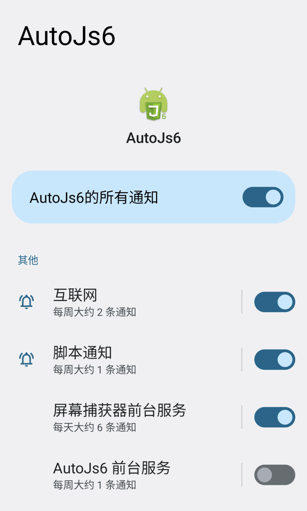
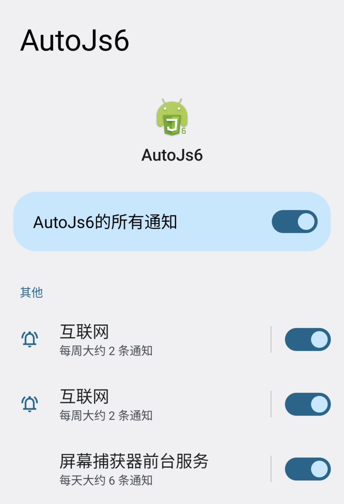
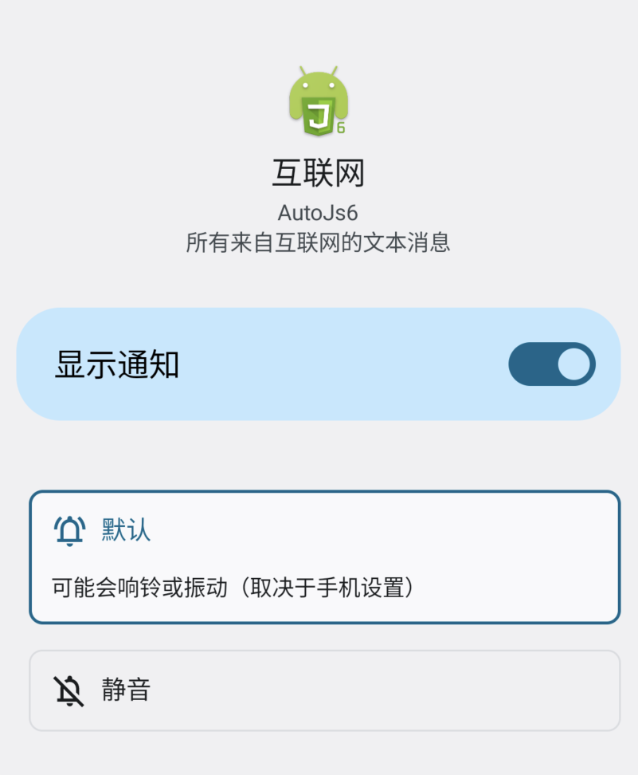

# NoticeChannelOptions

NoticeChannelOptions 是一个发送 AutoJs6 通知时用于设置 [渠道](notice#通知渠道) 的接口.  
这些设置将一次性作为初始值应用到指定的渠道上.

常见相关方法或属性:

- [notice.channel.create](notice#m-create)(channelId, **options**)
- [notice.channel.create](notice#m-create)(**options**)

---

<p style="font: bold 2em sans-serif; color: #FF7043">NoticeChannelOptions</p>

---

## [p?] id

- { [string](dataTypes#string) | [number](dataTypes#number) } - 渠道 ID

通知渠道使用 `渠道 ID (Channel ID)` 作为唯一标识, `id` 属性可指定当前发送通知的渠道 ID.

相同渠道 ID 的所有通知, 都共享同一个渠道配置.

渠道 ID 不会在通知消息中体现, 也不会在 AutoJs6 的通知设置页面体现, 它仅用于在编写程序时关联唯一的通知渠道.

当 `id` 不指定时, 其默认值的情况取决于 [config.useScriptNameAsDefaultChannelId](noticePresetConfigurationType#p-usescriptnameasdefaultchannelid) 配置值.  
配置值为 `true` 时, 渠道将以脚本文件全名进行创建和管理, 否则渠道将不作区分进行全局统一创建和管理.

```js
/* 指定渠道 ID. */

notice.channel.create({ id: 'exercies' });
notice('message', { channelId: 'exercise' }); /* 在 exercise 渠道上发送通知. */

/* 不指定渠道 ID */

/* 1. useScriptNameAsDefaultChannelId 启用 (默认). */
notice.config({ useScriptNameAsDefaultChannelId: true });
notice('message'); /* 在 ID 为当前脚本文件全名的渠道上发送通知. */

/* 2. useScriptNameAsDefaultChannelId 禁用. */
notice.config({ useScriptNameAsDefaultChannelId: false });
notice('message'); /* 在 ID 为内置固定值 "script_channel" 的渠道上发送通知. */
```

## [p?] name

- { [string](dataTypes#string) } - 渠道名称

设置通知渠道的名称, 用于辅助用户识别不同的渠道.

渠道名称不会出现在通知消息中, 而是出现在 AutoJs6 的通知设置中:

<picture>
  <source srcset="images/autojs6-notification-list-dark.png" media="(prefers-color-scheme: dark) and (max-width: 1024px)" width="822px">
    <source srcset="images/autojs6-notification-list-dark.png" media="(prefers-color-scheme: dark) and (min-width: 1024px)" width="411px">
    <source srcset="images/autojs6-notification-list.png" media="(min-width: 1024px)" width="411px">
    
</picture>

上述示例图片中, [ "互联网", "脚本通知", "屏幕捕获器前台服务" ] 等作为渠道名称, 便于用户区分不同的通知渠道.

渠道 ID 是唯一的, 但渠道名称可能重复:

<picture>
  <source srcset="images/autojs6-notification-list-with-same-names-dark.png" media="(prefers-color-scheme: dark) and (max-width: 1024px)" width="822px">
    <source srcset="images/autojs6-notification-list-with-same-names-dark.png" media="(prefers-color-scheme: dark) and (min-width: 1024px)" width="411px">
    <source srcset="images/autojs6-notification-list-with-same-names.png" media="(min-width: 1024px)" width="411px">
    
</picture>

上述示例图片中出现了名称相同的通知渠道 ("互联网"), 但它们拥有不同的渠道 ID.

当 `name` 不指定时, 其默认值的情况取决于 [config.defaultChannelName](noticePresetConfigurationType#p-defaultchannelname) 配置值.

```js
/* 创建一个名称为 "Network" 的渠道. */
notice.channel.create({ name: 'Network' });
```

## [p?] description

- { [string](dataTypes#string) } - 渠道描述

设置通知渠道的描述, 用于辅助用户了解渠道的用途等信息.

渠道描述不会出现在通知消息中, 而是出现在 AutoJs6 通知设置的渠道条目中:

<picture>
  <source srcset="images/autojs6-notification-item-details-dark.png" media="(prefers-color-scheme: dark) and (max-width: 1024px)" width="801px">
    <source srcset="images/autojs6-notification-item-details-dark.png" media="(prefers-color-scheme: dark) and (min-width: 1024px)" width="411px">
    <source srcset="images/autojs6-notification-item-details.png" media="(min-width: 1024px)" width="411px">
    
</picture>

上述示例图片中, "所有来自互联网的文本消息" 作为渠道描述, 便于用户了解渠道用途.

当 `description` 不指定时, 其默认值的情况取决于 [config.defaultChannelDescription](noticePresetConfigurationType#p-defaultchanneldescription) 配置值.

```js
/* 创建一个描述为 "Messages from network" 的渠道. */
notice.channel.create({ description: 'Messages from network' });
```

## [p?] importance

- [ 'high' ] { [number](dataTypes#number) | `'default'` | `'high'` | `'low'` | `'max'` | `'min'` | `'none'` | `'unspecified'` } - 渠道的通知重要性级别

设置通知渠道的通知重要性级别.

此选项会影响渠道内通知消息发出时的行为, 包括振动和提醒提示音等.

`importance` 参数接收由整形常量转化而来的字符串简化形式:

| 字符串           | 整形常量                                                                                       | 简述                                                                 |
|---------------|--------------------------------------------------------------------------------------------|--------------------------------------------------------------------|
| 'none'        | <span style="white-space:nowrap">NotificationManager.IMPORTANCE_NONE = 0</span>            | <span style="white-space:nowrap">无重要性. 通知不会出现在遮罩层.</span>          |
| 'min'         | <span style="white-space:nowrap">NotificationManager.IMPORTANCE_MIN = 1</span>             | <span style="white-space:nowrap">最低重要性.</span>                     |
| 'low'         | <span style="white-space:nowrap">NotificationManager.IMPORTANCE_LOW = 2</span>             | <span style="white-space:nowrap">低重要性. 遮罩层或状态栏显示通知, 无声音干扰.</span>  |
| 'default'     | <span style="white-space:nowrap">NotificationManager.IMPORTANCE_DEFAULT = 3</span>         | <span style="white-space:nowrap">默认重要性. 显示通知, 发出声音, 但无视觉干扰.</span> |
| **'high'**    | <span style="white-space:nowrap">NotificationManager.IMPORTANCE_HIGH = 4</span>            | <span style="white-space:nowrap">高重要性. 显示通知, 发出声音, 浮动通知.</span>    |
| 'max'         | <span style="white-space:nowrap">NotificationManager.IMPORTANCE_MAX = 5</span>             | <span style="white-space:nowrap">最高重要性.</span>                     |
| 'unspecified' | <span style="white-space:nowrap">NotificationManager.IMPORTANCE_UNSPECIFIED = -1000</span> | <span style="white-space:nowrap">未指定重要性. 由系统决定通知行为.</span>         |

以下示例将创建一个默认为关闭状态的通知渠道, 创建后需用户手动开启后才能显示发送到此渠道的通知:

```js
notice.channel.create('channel_with_importance_none', {
    importance: 'none',
});
```

当 `importance` 不指定时, 其默认值的情况取决于 [config.defaultImportanceForChannel](noticePresetConfigurationType#p-defaultimportanceforchannel) 配置值.

## [p?] enableVibration

- [ false ] { [boolean](dataTypes#boolean) } - 渠道振动状态

设置通知渠道的振动状态.

当 `enableVibration` 不指定时, 其默认值的情况取决于 [config.defaultEnableVibrationForChannel](noticePresetConfigurationType#p-defaultenablevibrationforchannel) 配置值.

## [p?] vibrationPattern

- [ null ] { [OmniVibrationPattern](omniTypes#omnivibrationpattern) } - 渠道振动模式

设置通知渠道的振动模式.

当 `vibrationPattern` 不指定时, 其默认值的情况取决于 [config.defaultEnableVibrationForChannel](noticePresetConfigurationType#p-defaultenablevibrationforchannel) 配置值.

## [p?] enableLights

- [ null ] { [boolean](dataTypes#boolean) } - 是否启用渠道的通知指示灯

设置通知渠道是否启用通知指示灯.

当 `enableLights` 不指定时, 其默认值的情况取决于 [config.defaultEnableLightsForChannel](noticePresetConfigurationType#p-defaultenablelightsforchannel) 配置值.

## [p?] lightColor

- [ null ] { [OmniColor](omniTypes#omnicolor) } - 渠道的通知指示灯颜色

设置通知渠道的通知指示灯颜色.

当 `lightColor` 不指定时, 其默认值的情况取决于 [config.defaultLightColorForChannel](noticePresetConfigurationType#p-defaultlightcolorforchannel) 配置值.

## [p?] lockscreenVisibility

- [ `'public'` ] { [number](dataTypes#number) | `'public'` | `'private'` | `'secret'` | `'no_override'` } - 渠道的通知可见详情级别

设置锁定屏幕中当前渠道的通知可见详情级别.

当 `lockscreenVisibility` 不指定时, 其默认值的情况取决于 [config.defaultLockscreenVisibilityForChannel](noticePresetConfigurationType#p-defaultlockscreenvisibilityforchannel) 配置值.

`lockscreenVisibility` 参数接收由整形常量转化而来的字符串简化形式:

| 字符串           | 整形常量                                                                                       | 简述                                                           |
|---------------|--------------------------------------------------------------------------------------------|--------------------------------------------------------------|
| **'public'**  | <span style="white-space:nowrap">NotificationCompat.VISIBILITY_PUBLIC = 1</span>           | <span style="white-space:nowrap">显示通知完整内容.</span>            |
| 'private'     | <span style="white-space:nowrap">NotificationCompat.VISIBILITY_PRIVATE = 0</span>          | <span style="white-space:nowrap">仅显示基本信息 (图标/内容/标题等).</span> |
| 'secret'      | <span style="white-space:nowrap">NotificationCompat.VISIBILITY_SECRET = -1</span>          | <span style="white-space:nowrap">不显示该通知任何部分.</span>          |
| 'no_override' | <span style="white-space:nowrap">NotificationManager.VISIBILITY_NO_OVERRIDE = -1000</span> | <span style="white-space:nowrap">用户未指定 (由系统决定).</span>       |